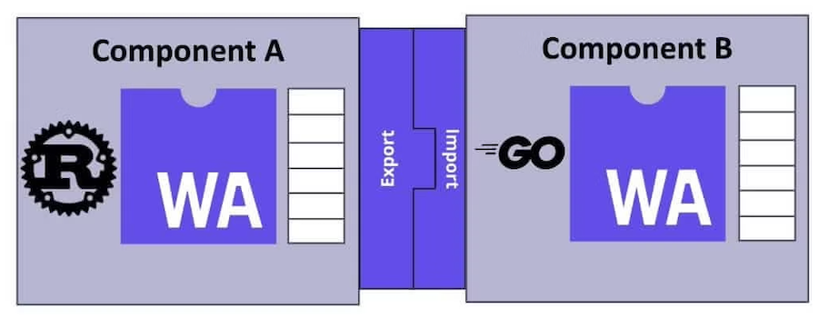

# Rust 🦀 and WebAssembly 🕸 resources and sample code

## WASM-PACK Template

[**📚 Read this template tutorial! 📚**](https://rustwasm.github.io/docs/wasm-pack/tutorials/npm-browser-packages/index.html)

This template is designed for compiling Rust libraries into WebAssembly andpublishing the resulting package to NPM.

- [tutorials](https://rustwasm.github.io/docs/wasm-pack/tutorials/index.html)
- [template-docs](https://rustwasm.github.io/docs/wasm-pack/tutorials/npm-browser-packages/index.html)

- using **strip = true** to fix Wasm module parse error!
```
ERROR in ../pkg/wasm_game_of_life_bg.wasm
Module parse failed: Unknown element type in table: 0xNaN
You may need an appropriate loader to handle this file type, currently no loaders are configured to process this file. See https://webpack.js.org/concepts#loaders
Error: Unknown element type in table: 0xNaN
```

```toml
[profile.release]
# Tell `rustc` to optimize for small code size.
opt-level = "s"
strip = true

[profile.dev]
strip = true
```

## [Tutorial: Conway's Game of Life](https://rustwasm.github.io/docs/book/game-of-life/introduction.html#tutorial-conways-game-of-life)
This is a tutorial that implements Conway's Game of Life in Rust and WebAssembly.

## [WebAssembly Linear Memory](webassembly-linear-memory)
Linear Memory is a vector of contiguous bytes in memory. The WebAssembly specification allows for modules to have more than one instance of a linear memory, but at the time this course was written, all practical implementations assume that memory operations implicitly operate on the memory instance at index 0.

Linear memory is allocated in multiples of the page size (65535 bytes or 64KiB), and WebAssembly modules can manipulate that memory without fear of interfering with any other memory used by the host or other modules. We have seen a few of these memory instructions in the WebAssembly text format before:

```
(type).load
For example, i32.load.

(type).store 
For example, f32.store.

size
Query the size of the memory instance.

grow 
Request an expansion of the memory instance. The new maximum size must be specified in multiples of the page size.
```

### [waPC protocol](wapc)
The WebAssembly Procedure Calls (waPC) project is like a standard module interface for WebAssembly on top of an extensible RPC framework.
- waPC aims to provide a bi-directional communications contract for stateless operation. 
- waPC can be used to build cross-platform applications. The protocol standardizes communication between native code calls and WebAssembly. Through waPC, a host can initialize and request calls to a guest and the guest can offer commands or functions the host can call.

## [WebAssembly Component Model(WCM)](https://github.com/WebAssembly/component-model)
The WebAssembly Component Model (WCM) allows one WebAssembly binary to safely interact with another over a structured interface.
- With WCM, libraries written in different languages (such as Rust, Python, JavaScript, Go, and more) can interoperate in a true polyglot fashion.
- A WebAssembly component exposes a set of imports and exports using the WebAssembly Interface Types (WIT) language. The WebAssembly runtime then instantiates all the proper components to run the application.



Component features:
- Components are portable, interoperabl (WebAssembly binaries .wasm files), and composable
- The component model that WebAssembly adopted is an alternative to decorating functions with (a)synchronous metadata. 
- The component model emphasizes modular, reusable components that can be composed to form larger applications. 
- The component model abstracts away the complexities of concurrency from the individual components, allowing the components to solely serve their specific task. The host runtime manages asynchronous operations and communication between components.
- Components can compile from a variety of languages and run across architectures.

Reference:
- https://www.infoq.com/articles/webassembly-component-model/
- https://wasmcloud.com/blog/webassembly-components-and-wasmcloud-actors-a-glimpse-of-the-future/
- https://www.cncf.io/blog/2024/07/09/webassembly-components-the-next-wave-of-cloud-native-computing/

### Implements and composes Components in wasmCloud
