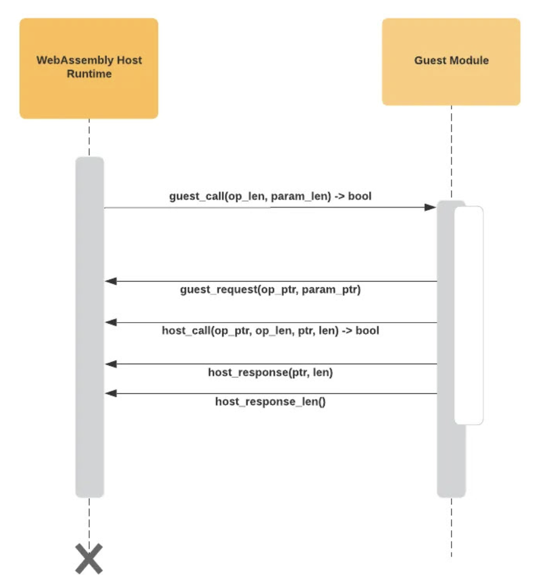

# waPC (WebAssembly Procedure Calls) Protocol Sample
- [waPC Specification](https://wapc.io/docs/spec)
- [introducing waPC](https://kevinhoffman.medium.com/introducing-wapc-dc9d8b0c2223)
- [Building WebAssembly platforms with waPC](https://jsoverson.medium.com/building-webassembly-platforms-with-wapc-3d5d6f99f871)

- waPC calls involve two basic pieces of data: a string operation name, e.g., “HandleRequest”, and the raw binary payload containing the operation’s parameters. waPC does not enforce any particular serialization mechanisms. The payload and responses always remain opaque blobs.

The logical flow is as follows:
1. The host initiates a function call exchange with the guest by invoking the “guest call” export. This export takes two parameters: the length of the operation name as a string and the length of the binary payload.
2. The guest internally allocates two buffers (again, the host does not care how this happens) and then tells the host the linear memory address offsets of the two buffers for the operation name and payload via the “guest request” function.
3. In response to the “guest request” function call, the host loads the request data for the call into linear memory at the locations indicated by the given pointers.
4. The guest module then performs the main body of its logic.
Optionally the guest module can then make requests of the host via the “host call” function. The host call function accepts many parameters, including the pointer and byte length of the operation name, payload (message body), and namespace (used for optional disambiguation between operations).
5. The guest either informs the host where to find a response via the “guest response” function or it informs the host where to find an error via “guest error”.
6. The guest function returns 0 for failure, 1 for success. Success cannot be misinterpreted by default values.
7. The host inspects the numeric return value, and then retrieves either the success bytes or failure bytes accordingly. The failure bytes can be used by higher-level projects to return robust error structures.

The guest always imports from a module called wapc, and most exported function names are preceded by two underscores to avoid accidental collisions with other exported functions.

- waPC Full Interaction


## waPC implementation for Rust
- [github](https://github.com/wapc/wapc-rs)
- [waPC Host Implementations](https://github.com/wapc/wapc-rs/tree/master/crates/wapc-guest)
- [waPC Guest Implementations](https://github.com/wapc/wapc-rs)

### Guest module
- Add a dependency on the wapc-guest crate

```toml
[dependencies]
wapc-guest = "1.2.0"
```

- Initialization (wapc_init):
This function registers a function named "ping" using wapc::register_function.

```rust
use wapc_guest as wapc;

#[no_mangle]
pub fn wapc_init() {
  wapc::register_function("ping", ping);
}
```

- Calls another function named host_call to potentially interact with the host. 

Here, it's likely calling a pong function on the host side. Converts the response from the host call (_res) to a string. Combines the original message (payload) with the host's response (pong_res) to form the final output.

```rust
fn ping(msg: &[u8]) -> wapc::CallResult {
  wapc::console_log(&format!(
    "IN_WASM: Received request for `ping` operation with payload : {}",
    std::str::from_utf8(msg).unwrap()
  ));

  let payload = std::str::from_utf8(msg)?;
  let _res = wapc::host_call("binding", "sample:namespace", "pong", msg)?;
  let pong_res = std::str::from_utf8(&_res)?;
  let output = format!("{}, {}!", pong_res, payload);

  Ok(output.as_bytes().to_vec())
}
```

- Make a release build of this module:
```
cd wapc-guest
cargo build --target wasm32-unknown-unknown --release
```

```
ls target/wasm32-unknown-unknown/release/
build           deps            examples        incremental     wapc_guest.d    wapc_guest.wasm
```

### Host (main function)
- Add waPC and runtime dependency

The choice of engine is one that we can make at design-time, allowing us to choose between JIT engines like Wasmtime and interpreting engines like wasm3.

```toml
[dependencies]
wapc = "2.1.0"
wasmtime-provider = "2.3.1"
```

- The load_file function just retrieves the raw bytes from our WebAssembly module.
```rust
let file = "../wapc-guest/target/wasm32-unknown-unknown/release/wapc_guest.wasm";
let module_bytes = std::fs::read(file)?;
```
- implement WebAssemblyEngineProvider

The constructor for the WapcHost struct takes a boxed object that implements the WebAssemblyEngineProvider trait and a closure or function to be used as the callback to handle invocation requests from the guest.

```rust
let engine = WasmtimeEngineProviderBuilder::new()
    .module_bytes(&module_bytes)
    .build()?;
let host = WapcHost::new(Box::new(engine), Some(Box::new(host_callback)))?;
```

- run the host example

``` 
cargo run

Guest 1 invoked 'binding->sample:namespace:pong' with a 4 byte payload
PONG, waPC!
```
